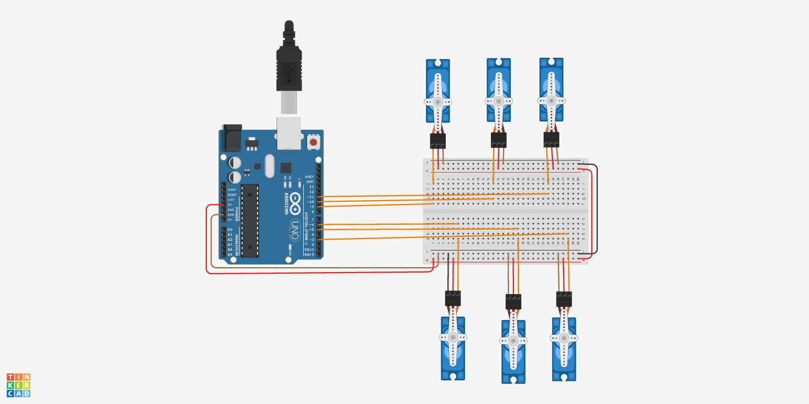

# Servo-Tasks
This project contains two main tasks:
## Task 1: Servo Motor Programming
This project show how to control six micro servo motors simultaneously using an Arduino UNO.
The servos are programmed to move together in a sweeping motion and then rest at a fixed position.


**The components Used**
1. ArduinonUNO
2. 6 Micro Servo Moters
3. Breadboard
4. Wires



*Figure 1: Top view of six servo motors control system.*


####  Tinkercad Simulation

You can view and simulate the full Arduino project on Tinkercad using the link below:
[Open Tinkercad Simulation](https://www.tinkercad.com/things/9sRHT7QQQ2C-6servo)

## Arduino Code

The code uses the Servo library to control all six servo motors at the same time. At startup, the servos sweep between 0° and 180° for a few cycles, then stop at the middle position (90°).

```cpp
#include <Servo.h>

Servo servo1, servo2, servo3, servo4, servo5, servo6;

void setup() {
  servo1.attach(3);
  servo2.attach(5);
  servo3.attach(6);
  servo4.attach(9);
  servo5.attach(10);
  servo6.attach(11);

  unsigned long startTime = millis();
  while (millis() - startTime < 2000) {
    for (int pos = 0; pos <= 180; pos += 5) {
      moveAll(pos);
      delay(15);
    }
    for (int pos = 180; pos >= 0; pos -= 5) {
      moveAll(pos);
      delay(15);
    }
  }

  moveAll(90);
}

void loop() {
}

void moveAll(int angle) {
  servo1.write(angle);
  servo2.write(angle);
  servo3.write(angle);
  servo4.write(angle);
  servo5.write(angle);
  servo6.write(angle);
}
```
## Task 2: Walking Motion Algorithm
The goal of this task is to describe the step-by-step process for humanoid walking motion.

### Algorithm:
1. Initialize all servos to 90° (neutral position).
2. Choose the supporting leg and the swinging leg.
3. Shift weight toward the supporting leg.
4. Lift the swinging leg (bend the knee, adjust the ankle).
5. Move the swinging leg forward (rotate the hip).
6. Place the foot down (straighten the knee, reset the ankle).
7. Shift weight back to the center.
8. Switch roles and repeat.
